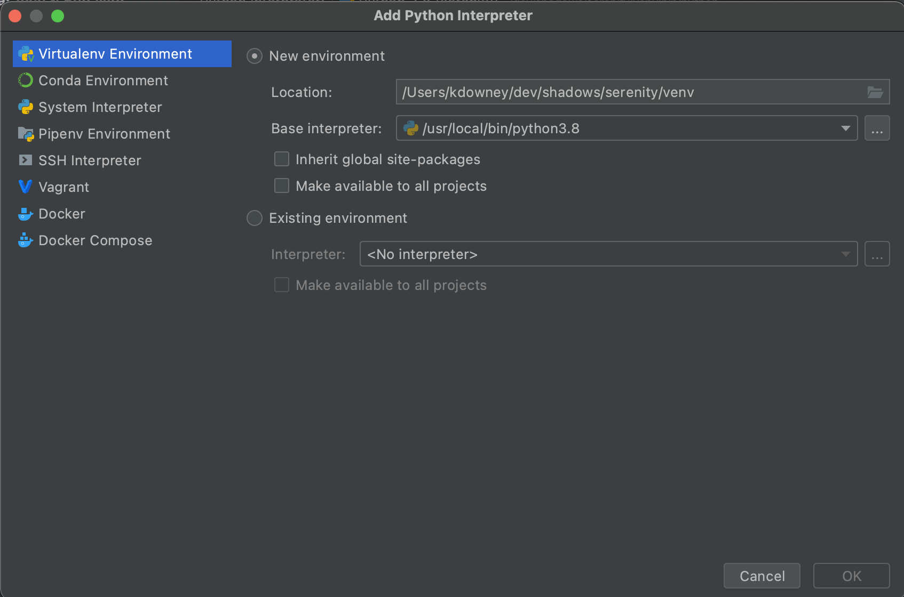
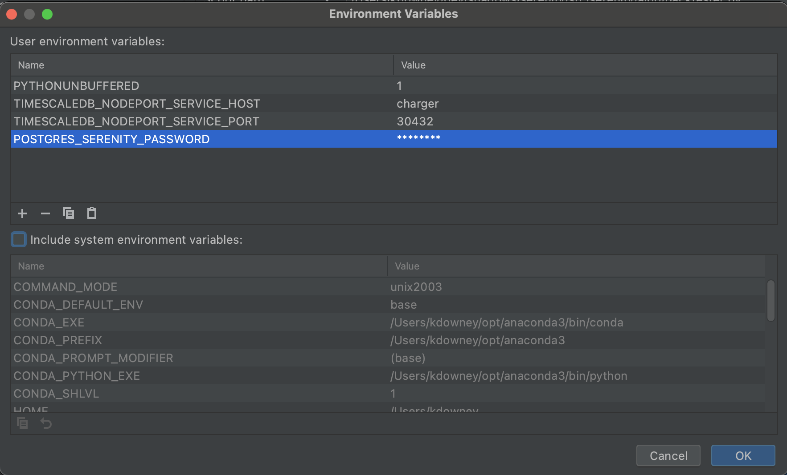
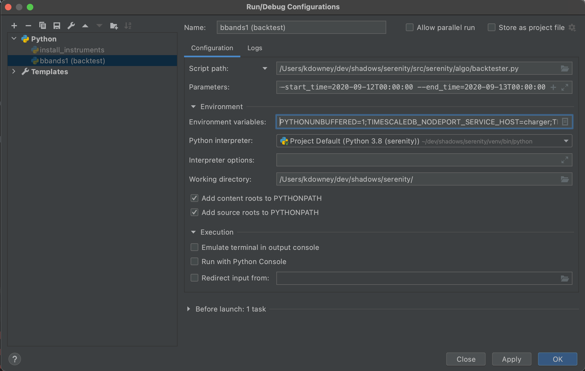
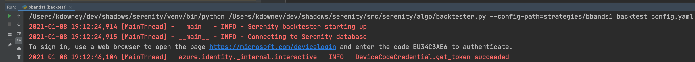
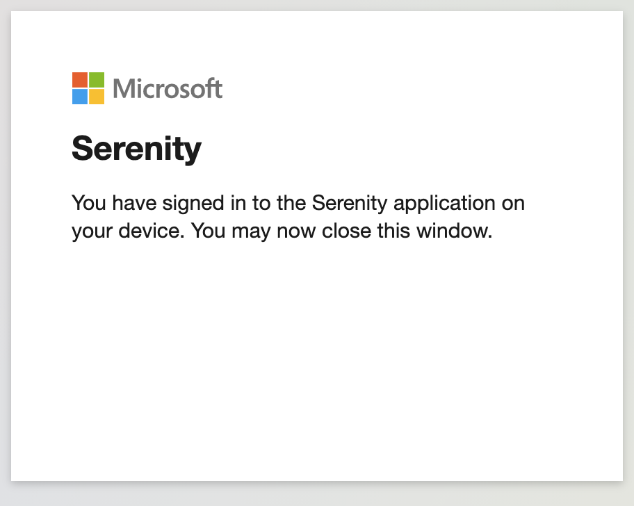

Quickstart: From Zero to Backtest
=================================

If you have completed the :doc:`install` you are probably keen to run Serenity. By the
end of this brief guide you will have access to Serenity's cloud storage; a local
copy of the code; and a running backtest for a simple Bitcoin trading strategy located
under ``strategies/bbands1.py``.

Gather parameters
-----------------
You will need the following post-install:

* your TimescaleDB host
* your TimescaleDB port
* your serenity datdabase pasword

so note these down for later.

Get a Serenity login
--------------------

Serenity runs either on your desktop or under Kubernetes, but it relies on Azure for
certain services like the tick database for Bitcoin strategy backtesting. Consequently
a Microsoft login is required and your account will need to be provisioned for
Serenity. You can sign up here: https://azure.microsoft.com/en-us/free/. Note the
same account is also used to grant contributors access to the
`Serenity Azure DevOps portal <https://dev.azure.com/cloudwall/Serenity>`_, but this
is not required for regular users.

Partcipants in :doc:`devdays` will be provisioned when they sign up, so let Kyle
know your login once you have it.

Fork the code
-------------

Git clone will work, but Serenity follows a standard GitHub
`fork/pull workflow <https://gist.github.com/Chaser324/ce0505fbed06b947d962>`_, so I strongly recommend
that you fork our master repository and then clone your fork; this will make it easier
to contribute patches in the future: https://github.com/cloudwall/serenity.

Create a virtualenv
-------------------
We need to create a virtual environment (venv) before anything else. In PyCharm you'll
want a setup something like this to start:

and then you can go to your console and install the dependencies with ``venv/bin/pip install -r requirements.txt``.

Create a runner
----------------

We are ready to set up a runner on our desktop for the backtest. This particular guide
assumes you are using PyCharm as an IDE and running on your desktop rather than in a
production server, but it should work for VS Code or other Python IDE's as well.

Go to "Add Configuration..." and set up as follows:

* Name: bbands1 (backtest)
* Script: ``src/serenity/algo/backtester.py``
* Command line:

.. code-block:: plain

   --config-path=strategies/bbands1_backtest_config.yaml
   --strategy-dir=strategies/
   --start_time=2020-09-12T00:00:00
   --end_time=2020-09-13T00:00:00

* Working directory: *your fork's root directory*, e.g. ``/Users/kdowney/dev/shadows/serenity``

and then edit environment variables as shown, using the database parameters gathered above:

You should end up with something like this:

Run the backtest
----------------

There is now nothing left to do but run the backtest! Start it up, and you should see something like
the following:

Click the link, enter the one-time passcode, and then when you see:

go back to PyCharm and let the backtest run to completion.

Verify the backtest
-------------------
The log output should contain something like the following at the very end:

.. code-block:: plain

   2021-01-08 20:40:12,432 [MainThread] - bbands1 - INFO - Trade P&L=292.9031018918659; cumulative P&L=1129.3557867081922
   2021-01-08 20:40:12,433 [MainThread] - bbands1 - INFO - Position[account=9019590001, instrument=PHEMEX:BTCUSD, qty=0]
   2021-01-08 20:40:25,693 [MainThread] - serenity.analytics.api - INFO - storing snapshots in /Users/kdowney/.serenity/snapshots/BACKTEST/BollingerBands/20210108204025
   2021-01-08 20:40:25,754 [MainThread] - __main__ - INFO - stored snapshot: BACKTEST/BollingerBands/20210108204025

If your cumulative P&L matches, you're done!